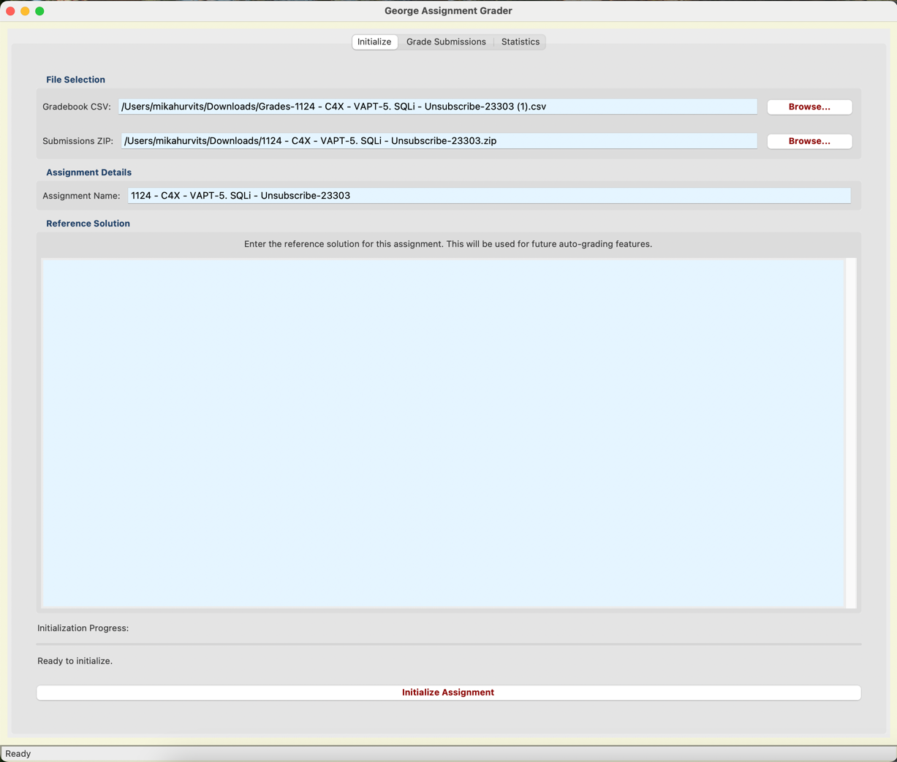
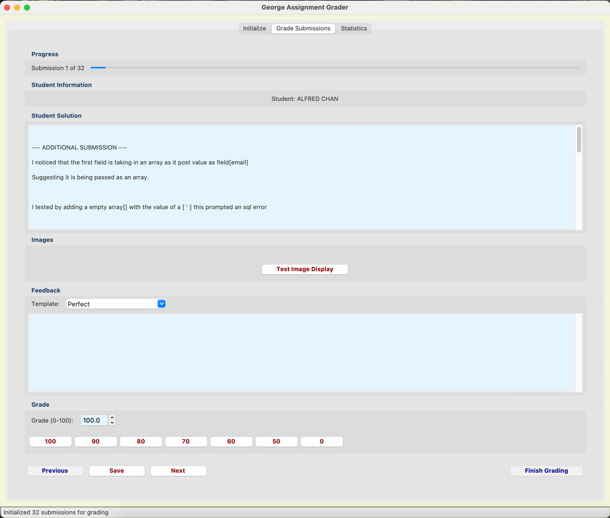
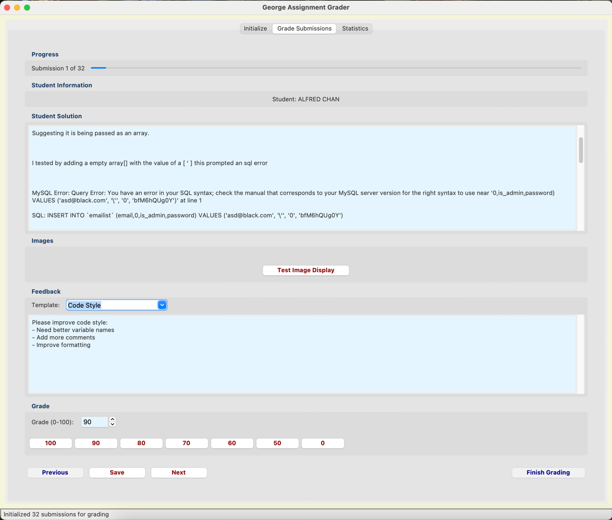
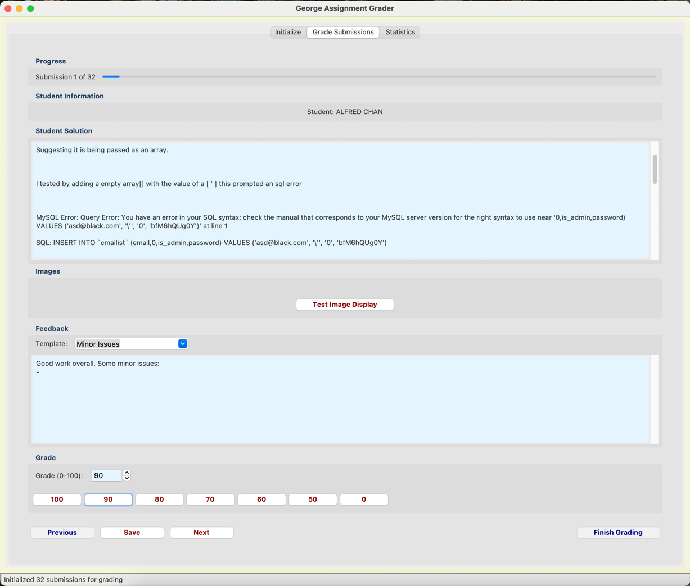
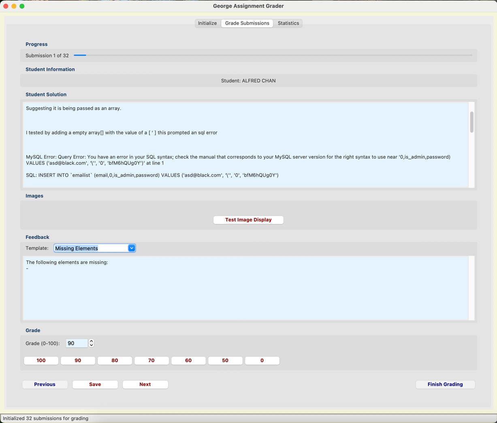
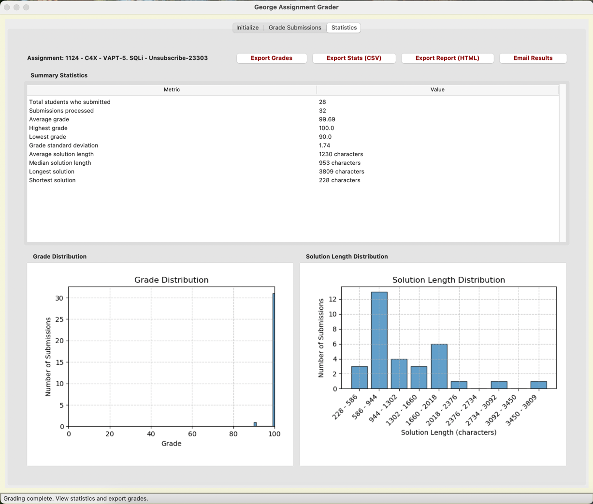

# George Assignment Grader

A Python application for instructors to efficiently grade student assignments. The application provides a user-friendly interface to process student submissions, grade their work, view statistics, and share results.

## Features

- **Submission Processing**: Automatically extract student submissions from ZIP archives and CSV gradebooks
- **Multiple File Format Support**: Handle TXT, DOCX, PDF, HTML, and image files
- **Interactive Grading Interface**: Grade submissions with predefined feedback templates and quick grade buttons
- **Image Support**: View images embedded in submissions or submitted as separate files
- **Statistical Analysis**: Generate statistics on grades and submission characteristics
- **Visualizations**: View grade distributions and solution length statistics with interactive charts
- **Export Options**: Export grades, statistics, and complete HTML reports with embedded visualizations
- **Email Integration**: Share results via your system's default email client

## Screenshots


### Main Application Interface

*Overview of the main application window showing the primary interface*

### Grading Interface

*The grading interface where instructors evaluate student submissions*

#### Different Grading States
The grading interface adapts to show different states based on the submission quality:

<div style="display: grid; grid-template-columns: repeat(2, 1fr); gap: 10px;">
    <div>
        
        <em>Perfect submission - All requirements met</em>
    </div>
    <div>
        
        <em>Submission with code style issues</em>
    </div>
    <div>
        
        <em>Submission with minor issues to be addressed</em>
    </div>
    <div>
        
        <em>Submission with missing required elements</em>
    </div>
</div>

### Statistics and Analysis

*Statistical analysis view showing grade distributions and metrics*

## Project Structure

```
assignment_grader/
├── __init__.py
├── main.py                    # Entry point script
├── models/                    # Domain models
│   ├── __init__.py
│   └── student_submission.py  # StudentSubmission class
├── core/                      # Core functionality
│   ├── __init__.py
│   ├── assignment.py          # Main Assignment class
│   ├── file_processor.py      # File processing utilities
│   ├── grading_workflow.py    # Interactive grading workflow
│   └── statistics.py          # Statistical analysis
├── gui/                       # GUI components
│   ├── __init__.py
│   ├── image_viewer.py        # Image viewing component
│   ├── init_tab.py            # Initialization tab
│   ├── grading_tab.py         # Grading tab with feedback templates
│   ├── main_window.py         # Main application window
│   ├── stats_tab.py           # Statistics and reporting tab
│   └── styling.py             # GUI styling and theme
├── utils/                     # Utility functions
│   ├── __init__.py
│   ├── email_client_utils.py  # Email functionality
│   ├── export_utils.py        # Data export functions
│   ├── file_utils.py          # File-related utilities
│   ├── image_utils.py         # Image processing utilities
│   └── text_utils.py          # Text processing utilities
└── README.md                  # Project documentation
```

## Installation

### Prerequisites

- Python 3.6 or higher
- Tkinter (usually comes with Python, but may need to be installed separately on some systems)

### Required Packages

```bash
pip install pandas numpy matplotlib pillow PyPDF2 docx2txt html2text filetype
```

### Optional Packages

To enable all features, particularly for document processing:

```bash
pip install python-docx pymupdf
```

## Usage

### Running the Application

```bash
# From the project root directory
python main.py

# Or with command-line interface mode
python -m assignment_grader.main --cli
```

### Workflow

The application follows a three-step workflow:

1. **Initialization**
   - Select a gradebook CSV file and submissions ZIP archive
   - Enter assignment name and reference solution
   - Process student submissions automatically

2. **Grading**
   - View each student's submission (text and images)
   - Select feedback templates or enter custom feedback
   - Assign grades with quick grade buttons or custom values
   - Navigate between submissions with previous/next buttons

3. **Analysis and Reporting**
   - View summary statistics on grades and submissions
   - Explore grade distribution and solution length visualizations
   - Export grades, statistics, or complete HTML reports
   - Email results to stakeholders

## Key Components

### Assignment Class

The `Assignment` class manages the collection of student submissions and handles CSV and ZIP file processing. It maintains the list of submissions, updates the gradebook, and provides methods for exporting data.

### StudentSubmission Class

The `StudentSubmission` class represents an individual student's submission, storing the student's name, their solution, grade, and feedback. It also handles file parsing and image extraction.

### FileProcessor

The `FileProcessor` extracts submissions from various file formats, detects file types, and processes both text and image content.

### GUI Components

The GUI is built with Tkinter and organized into tabs:
- **Initialization Tab**: File selection and submission processing
- **Grading Tab**: Interactive grading interface with feedback templates
- **Statistics Tab**: Statistical analysis and reporting

### ImageViewer

The `ImageViewer` component displays images from student submissions with navigation controls for multiple images.

## Customization

### Feedback Templates

You can customize the feedback templates in `grading_tab.py` by modifying the `FEEDBACK_TEMPLATES` dictionary:

```python
FEEDBACK_TEMPLATES = {
    "Perfect": "Excellent work! All requirements met perfectly.",
    "Minor Issues": "Good work overall. Some minor issues:\n- ",
    # Add your own templates here
}
```

### Styling

The appearance of the application can be customized in `styling.py` by adjusting colors, fonts, and other UI elements.

## Troubleshooting

### Images Not Displaying

If images from submissions are not displaying:

1. Make sure PIL/Pillow is properly installed: `pip install pillow`
2. Check if the image format is supported (JPG, PNG, GIF, BMP)
3. Look for error messages in the console output

### File Processing Issues

If submissions are not being processed correctly:

1. Check the format of your gradebook CSV file
2. Ensure the ZIP file structure follows the expected pattern
3. Verify that you have the necessary packages installed for document processing

## Contributing

Contributions are welcome! Please feel free to submit a Pull Request.

## License

This project is licensed under the MIT License - see the LICENSE file for details.

## Acknowledgments

- Thanks to all the open-source libraries that made this project possible
- Special thanks to the educators who provided feedback during development